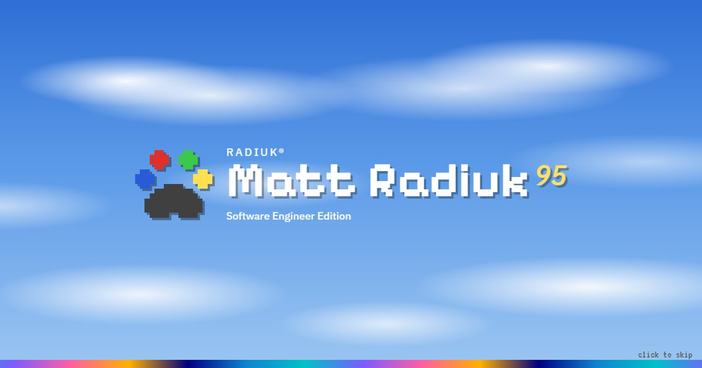

# Matt Radiuk 95

The personal site of **Matt Radiuk**, software engineer, built as a tiny Windows 95-style operating system that runs in the browser.

**Live:** https://www.radiuk.ca



## What's in the box

- **A real(ish) desktop.** Draggable, resizable windows with snap-to-edge, minimize/maximize animations, a taskbar, a cascading Start menu, context menus, rubber-band icon selection and keyboard navigation.
- **About_Me.doc.** A WordPad document with a font picker that actually works (yes, Comic Sans is in there).
- **My Computer.** System Properties, with skills listed as hardware in Device Manager.
- **Projects.** 18 interactive [p5.js](https://p5js.org) sketches: the originals from the old site plus new ones (3D Pipes, Synthwave, a GPU Julia set explorer, Fourier epicycles, Game of Life, Lorenz attractor, Doom fire, and more).
- **My Pictures + Image Viewer.** The photo gallery, with slideshow, zoom, keyboard and swipe support.
- **Contact Me.** An Outlook Express-style compose window that posts to Formspree.
- **MS-DOS Prompt.** A small shell with a virtual C: drive (`help`, `dir`, `cd`, `type`, `neofetch`, `color 0a`...) and some undocumented commands.
- **Minesweeper**, **Pablo.exe** (a "The Life of Pablo" cover generator), **Notepad**, **Recycle Bin**, **Help**, and **Run…** (`Ctrl+K`), which works as a command palette.
- **Display Properties.** Color schemes (including *Midnight*, a dark mode), live p5.js wallpapers and screen savers. Leave the site idle for 2 minutes to see one.
- **Boot sequence**: a BIOS POST screen and splash, once per session. Skippable.
- **Benji**, the resident Australian Shepherd, lives in the system tray.
- Sounds are synthesized live with the Web Audio API, icons are original 16×16 pixel art, and the layout works on phones too.

## Tech

Plain HTML, CSS and JavaScript ES modules. **No framework, no bundler, no build step.**
p5.js is lazy-loaded from cdnjs only when a sketch runs.

```
amplify.yml            Amplify build spec (publishes site/ as-is)
site/
  index.html           the desktop
  sketch.html          any sketch full-screen: sketch.html?id=pipes
  404.html             Win95-style "file not found"
  gallery/, pablo/     redirects so the old radiuk.ca URLs keep working
  css/                 base (tokens, color schemes) · win95 (components) · desktop · apps
  js/
    content.js         ← all the editable copy, links, skills, photos and tips
    main.js            boot, routing, keyboard shortcuts
    os/                window manager, menus, taskbar, start menu, desktop, boot,
                       sound synth, icons, screensaver, wallpaper, p5 host, BSOD...
    apps/              one module per program (lazy-loaded)
    sketches/          one module per p5.js sketch + index.js catalog
  img/                 photos, gallery thumbnails, project thumbnails, og image
```

## Editing content

Almost everything lives in **`site/js/content.js`**: bio, roles, skills (the Device Manager entries), links, photo captions, Benji's tips, README.TXT and WHATSNEW.TXT. Lines marked `TODO` are guesses worth double-checking.

- **Photos:** add `site/img/gallery/<name>.jpg` (about 1600px on the long edge) and `site/img/gallery/thumbs/<name>.jpg` (360×270), then add an entry to `photos` in `content.js`.
- **Sketches:** add `site/js/sketches/<id>.js` exporting `default (p, env) => { ... }` (p5 instance mode; use `env.hovering()` to tell whether the cursor is over the canvas), register it in `site/js/sketches/index.js`, and drop a 400×300 thumbnail at `site/img/projects/<id>.jpg`. To make a thumbnail, open `sketch.html?id=<id>&thumb=1&warm=200` and screenshot it. `warm` pre-runs that many frames.

## Running locally

ES modules need to be served over HTTP (not `file://`). Any static server works:

```bash
npx serve site          # or
python -m http.server 8080 --directory site
```

## Deploying on AWS Amplify

1. In the [Amplify console](https://console.aws.amazon.com/amplify/), choose **Create new app → GitHub**, authorize, and pick the `radiuk.ca` repo on the `main` branch.
2. Amplify detects `amplify.yml`. It has no build step and publishes `site/`. Click **Save and deploy**.
3. *(Optional)* Under **Hosting → Rewrites and redirects**, add `/<*>` → `/404.html` with type **404 (Rewrite)** for the custom 404 page.
4. *(Optional)* Under **Hosting → Custom domains**, add `radiuk.ca`. Amplify shows the DNS records to create. If DNS stays on Cloudflare, add the CNAMEs there and set them to **DNS only** (grey cloud) so Amplify can issue its certificate.

Every push to `main` redeploys automatically.

> **Formspree:** if the form has domain restrictions turned on, add the new Amplify domain in the Formspree dashboard.

## Handy URLs

| URL | What it does |
| --- | --- |
| `/#about`, `/#projects`, `/#contact`, `/#terminal`, `/#pablo` … | open an app directly (every window updates the URL, so links are shareable) |
| `/#projects/pipes` | open a specific sketch |
| `/#pictures/petra` | open a specific photo |
| `/?boot=1` / `/?boot=0` | force / skip the boot sequence |
| `/?scheme=midnight` | try a color scheme for one visit |
| `/?wallpaper=live:synthwave` | try a wallpaper for one visit |
| `/?demo=bsod` | jump to an easter egg (`start`, `run`, `bsod`, `shutdown`, `party`, `saver`, `tip`) |

## Credits

- [p5.js](https://p5js.org) by the Processing Foundation.
- Fonts: [Pixelify Sans](https://fonts.google.com/specimen/Pixelify+Sans), [IBM Plex Sans/Mono](https://www.ibm.com/plex/), [VT323](https://fonts.google.com/specimen/VT323) (all OFL).
- Pablo.exe is inspired by Ivan Malagón's original TLOP cover generator.
- Doom fire palette and algorithm documented by Fabien Sanglard.
- Windows 95 is a trademark of Microsoft. This site is an affectionate tribute and isn't affiliated with Microsoft.
